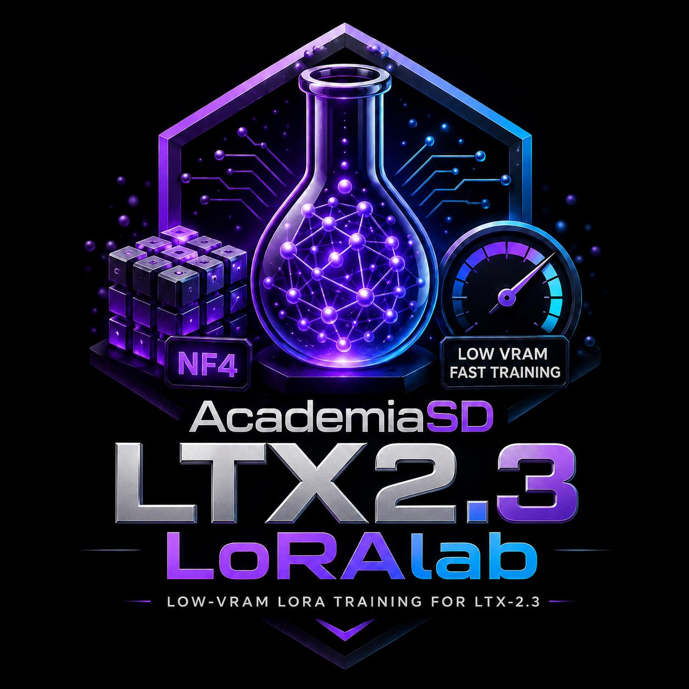
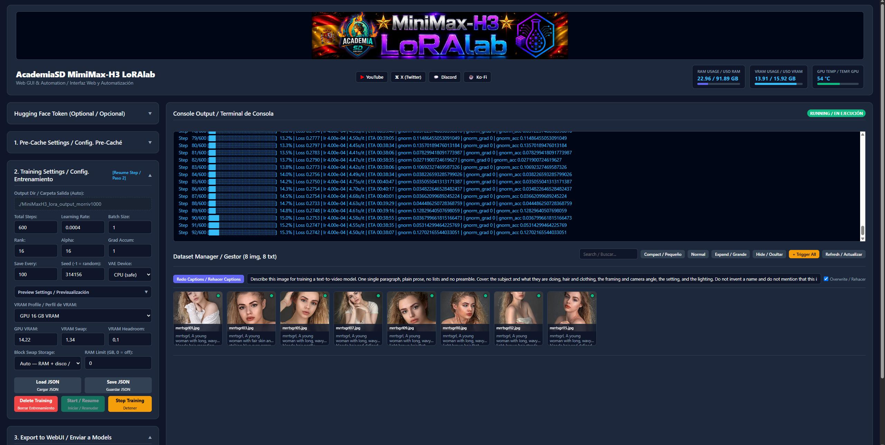

# AcademiaSD LoRAlab-MiniMax-H3 Beta v0.98



<p align="center">
  <b>Train MiniMax-H3 character & style LoRAs on a consumer GPU — a 33-Billion parameter joint video+audio DiT, from 8 GB of VRAM.</b>
</p>

<p align="center">
  
  
  
  
  
</p>

---

<p align="center">
  
</p>

---

## 🎯 What this is

**MiniMax-H3** is a 33-Billion parameter Diffusion Transformer that generates video **and audio jointly**, from a single packed sequence. The official checkpoint is **498 GB**; the generic partition alone is **135 GB**. Training a LoRA on it normally means datacenter hardware.

**AcademiaSD LoRAlab MiniMax-H3** trains character and style LoRAs from a folder of **images and captions**, on a **16 GB consumer GPU**, in about **40 minutes** — and down to **8 GB** if you are patient.

> **Verified result:** 8 images at **576×576**, **600 steps**, LR 2e-4, **rank/alpha 16** → excellent likeness *and* full prompt obedience, confirmed in ComfyUI video generation and tested alongside several Turbo LoRAs. These are the shipped defaults. On an RTX 5080 (16 GB) that is about **~3.7 s/it**, roughly **37 minutes**.

> **Why rank 16 and not rank 8.** Rank 8 produces an equally good likeness for less VRAM, which makes it look like the better deal — but it is not. With only 8 directions per matrix the adapter runs out of room for the identity and starts occupying directions the base model was using for composition. The symptom is subtle and easy to misread: the face is perfect, and the model stops obeying the prompt. Ask for a beach and you get a bedroom. Rank 16 has room for the identity without evicting anything, so likeness and prompt adherence improve together.

This trainer is for **image datasets** (characters, faces, styles). It does not train video clips or audio.

---

## 🔬 Technical Deep-Dive: how a 33B model fits in 16 GB or less.

### 1. 📉 The model is compressed 135 GB → 39 GB

* **4-bit NormalFloat (NF4) quantization**: the 50-block DiT backbone and the Qwen3-VL-32B text encoder are stored as `Linear4bit` NF4 weights. Measured on disk: **135 GB → 39 GB**. Only **86,474,752** parameters are trainable — **0.26 %** of the model's 33,209,467,648.
* **Precision-critical modules stay in float**: the model declares `proj_in`, `audio_proj_in`, `time_embedder`, `proj_out`, `audio_proj_out` and `rope` as `_keep_in_fp32_modules`. These plus the modulation path (`norm_out`, `context_embedder`, `token_refiner`) are reloaded **without** NF4 from a `precision_critical` section of the quantized repo. Quantization error there breaks the final AdaLN cancellation.
* **Adjustable block swap**: transformer blocks are parked outside VRAM and streamed in just in time, with a **hard cap** (`set_per_process_memory_fraction`) so the process physically cannot exceed its budget. This is what lets you *simulate* a smaller card and know whether a run would fit on 12 GB before you own one.

* **Frozen weights never travel home** (`nf4_cpu_home`): the NF4 weights are read-only, so once a block's CPU-side bytes exist they stay valid forever. The swap uploads them and then simply releases the GPU copy, instead of downloading 0.28 GB back over PCIe every time — which, at ~94 block evictions per step, was **26 GB of pointless PCIe traffic and 94 allocate/free cycles per step**. Removing it **halved the step time on every profile** and cut system RAM from 28.8 GB to 17.1 GB on a 16 GB card. Those CPU-side bytes are the memory-mapped checkpoint itself, so the trainer's hard RAM requirement is **2.2 GB**; the rest is file-backed and the OS can reclaim it.
* **Zero VRAM spent on encoders**: during training **neither the text encoder nor the VAE are loaded**. Every embedding and latent is computed once, offline, in the pre-cache stage.
* **fp32 LoRA weights and optimizer state**: deliberately *not* 8-bit. On H3 the per-parameter LoRA gradients are tiny; `AdamW8bit` quantizes `exp_avg_sq` (squared gradients ~1e-6) and destroys exactly the low-magnitude components where facial detail lives. The result is a LoRA that gets pose, hair and framing right and leaves the face soft. fp32 costs ~6 bytes/param and fixes it.

### 2. ⚡ Why it is fast

* **No per-step encoding**: 100 % of GPU compute during training goes to the DiT forward/backward. No VAE, no 32B language model in the loop.
* **(1,2,2) patch packing**: video latents are packed into 2×2 spatial patches, cutting the self-attention sequence length 4×.
* **Reentrant gradient checkpointing**: `bitsandbytes` stashes its quantized weight as a plain `ctx` attribute rather than through `save_for_backward`, so non-reentrant checkpointing does **not** discard it — every executed `Linear4bit` would pin its NF4 weight in VRAM until backward, and the block swap would silently stop working. Reentrant checkpointing runs the forward under `no_grad`, so nothing is pinned.
* **Pinned RAM and non-blocking transfers** for the cached latents and embeddings.

### 3. 🎨 Why the likeness is preserved

* **The exact H3 conditioning**: MiniMax-H3 conditions on the **unnormalized hidden state after decoder layer 50** of Qwen3-VL-32B — not the last layer, not a normalized one. The pre-cache truncates the 64-layer stack to 50 and replaces the final norm with `Identity`, so `hidden_states[50]` is the raw layer-50 output the model expects.
* **The exact VAE convention**: ImageNet-normalized pixels over a `[0,1]` base (not the usual `[-1,1]`), then per-channel `(z − latents_mean) / latents_std`.
* **The exact flow-matching convention**: `noised = (1−σ)·x0 + σ·noise`, timestep `t = 1−σ` in `[0,1]` **unscaled** with `t = 1` meaning *clean*, and a data-ward velocity target of `x0 − noise`. H3 inverts the sign relative to standard flow-match schedulers.
* **The correct sigma schedule**: logit-normal sampling with the resolution-dependent shift `mu = 0.5 + (tokens−256)·(1.15−0.5)/(6400−256)`. The video sampler's `shift = 12.0` is **wrong for training** and ruins likeness.
* **Correct export keys**: the trained adapter is translated from the diffusers module layout to the original checkpoint layout that ComfyUI loads — including the **SwiGLU half swap on `mlp.fc1`** (the reference stores `[gate; value]`, diffusers stores `[value; gate]`) and the QKV fusion. Getting this wrong produces a LoRA that visibly changes the output while learning nothing about your subject.

---

## ✨ Features

### Training
- **🌐 Modern Web GUI** — pre-cache, dataset editing, training, previews, checkpoints and export from a single-page Flask app.
- **🚀 1-Click launch** — `Run_LoRAlab-MiniMaxH3.bat` starts the server and opens `http://127.0.0.1:5000`.
- **🎛️ VRAM profiles** — a dropdown with presets for **32, 24, 16, 12, 10 and 8 GB** cards. Every field stays editable by hand; the dropdown switches to *Custom* the moment you type, so it never advertises a preset that does not match your values.
- **💽 Block swap storage** — parked blocks live in **RAM** (default), on **disk** as a memory-mapped file, or **Auto**, which keeps them in RAM until a system-RAM ceiling you set would be crossed and spills the rest. Disk is not a speed option — it measured the same as RAM — but the memory it uses is evictable, so a machine short on RAM degrades instead of running out. The file is sized to the blocks actually parked and deleted when training ends.
- **⏱️ Exact-step resume** — stop at any step and continue from it. The checkpoint is written atomically with a strict invariant (weights → optimizer → step file, and the step file only if the first two succeeded), so a kill mid-write can never leave an inconsistent resume point.
- **🎲 Deterministic across pauses** — the RNG is seeded **per step** with a splitmix64 mix of `(seed, step)`, and the dataset sampler is a shuffled per-epoch permutation derived from the same step index. Step N always sees the same image, sigma and noise whether it came from one continuous run or ten resumes.
- **🔁 Live settings** — edit preview settings, `save_every`, `lr`, `max_grad_norm` or lower `total_steps` **while training is running**, press *Save JSON*, and the change lands on the next step. Costs one `getmtime` per step.
- **📈 Total training time** — reported bilingually at the end (e.g. `2 Hours 26 Minutes / 2 Horas 26 Minutos`), accumulated across resumes.
- **📝 Full run log on disk** — everything the console shows is mirrored to `<output_dir>/train_log.txt`, flushed on every write, so a crash or a closed browser tab never loses the history.

### Previews
- **🖼️ In-training previews** — every N steps the current LoRA generates an image, shown live in the gallery. `0` disables it completely.
- **🎬 Real joint sampling** — the preview runs the actual packed `[text | audio | video]` sequence with two independent sigma schedules and per-row timesteps, which is the layout the model was trained on.
- **🗣️ Four prompt modes** — *First* (comparable across steps), *Random* (varied), *Rotate* (covers the dataset), *Custom* (a free prompt, encoded by the pre-cache).
- **💾 VAE on CPU or CUDA** — the VAE decoder is ~2.4 G parameters (4.8 GB in bf16). On CPU it costs ~90 s and touches no VRAM; on a 24 GB+ card, CUDA takes seconds.
- The previews are of very poor quality and the generation times are long; it is recommended to activate it only on GPUs with a lot of VRAM.

### Dataset Manager
- **🖼️ Visual grid & caption editor** — caption status badges (🟢 present / 🔴 missing), filename overlays, a lightbox to edit `.txt` captions directly on disk, and a batch tool to inject trigger words.
- **🤖 Auto-captioning** — one button writes a caption for every image with **Qwen3-VL-4B-Instruct**, trigger word first. The button reads *Create Captions* or *Redo Captions* depending on what already exists, and asks before overwriting. The prompt is editable, so you can steer the style without touching code.
- **🗑️ Per-image delete** — a trash icon on each thumbnail removes the image **and its `.txt`** from disk, with a confirmation naming the file.
- **🧹 Delete project data** — two buttons wipe the current project's **pre-cache** or **training output**, each behind its own confirmation. They refuse to run while a process is active, since deleting underneath a running trainer leaves it writing into a checkpoint that no longer exists.
- **📊 Dataset summary** — image count, epochs, and the video-token grid, reported before training starts so you can plan the next experiment.

### System
- **📊 Real-time telemetry** — RAM, VRAM and GPU temperature with colour coding.
- **🔑 Hugging Face token support** — optional `HF_token.json` for faster downloads with live progress.
- **📂 Automatic project folders** — `./cached_data_minimaxh3_<project>` and `./minimaxh3_lora_output_<project>`.
- **🚀 One-click export** — send the finished `.safetensors` to your ComfyUI / Forge / A1111 `models/loras` folder.
- **🌐 Fully bilingual (English / Español)** — every message is `English / Español` on the same line, English first.

---

## 🖥️ System Requirements

| Requirement | Minimum | Recommended |
| :--- | :--- | :--- |
| **OS** | Windows 10/11 | Windows 11 |
| **GPU** | NVIDIA, **8 GB VRAM** | NVIDIA, **16–24 GB VRAM** |
| **System RAM** | **16 GB** with disk swap (see below) | **32 GB** |
| **Disk** | **45 GB** for the NF4 model, **+8 GB** if you use auto-captioning | 60 GB+ |
| **Python** | 3.10+ (inside `venv`) | 3.11 / 3.13 |
| **CUDA** | 12.1+ | 12.8 / 13.0 |

### VRAM profiles

The three VRAM fields are **computed, not fixed**. Pick your card in the dropdown — or **Auto** to detect it — and the trainer sizes them for *your* resolution and *your* caption lengths, because both change how much VRAM a step needs. Picking a size smaller than your card **simulates** it, which is how you find out whether a run would fit on a 12 GB GPU without owning one.

Typical values with short captions, at the default 576×576 and at 768×768:

| Card | GPU VRAM @576² | @768² | Blocks @576² | Blocks @768² | s/it @576²*|
| :--- | ---: | ---: | ---: | ---: | ---: |
| 32 GB | 21.22 | 21.22 | 50 of 50 | 50 of 50 | no swap |
| 24 GB | 21.22 | 21.22 | 50 of 50 | 50 of 50 | no swap |
| **16 GB** | **14.22** | **13.89** | **29 of 50** | **28 of 50** | **~3.7** |
| 12 GB | 10.22 | 9.56 | 17 of 50 | 15 of 50 | ~5.8 |
| 10 GB | 7.89 | 7.23 | 10 of 50 | 8 of 50 | ~7.1 |
| 8 GB | 5.89 | 5.23 | 4 of 50 | 2 of 50 | ~8.1 |

** Estimated speed for an RTX 5080 with 16GB of VRAM.
`Swap` stays at **1.34** and `Headroom` at **0.1** for every card.

**What the low end really costs.** Every swapped block costs about **0.18 s/it**, measured. An 8 GB card keeps only 4 of the 50 blocks resident, so a step takes ~8.1 s against ~3.7 s on a 16 GB card: a 600-step run is about **80 minutes** instead of 37. It works, it is just slower — the block swap is what makes it possible at all.

Dropping to 512×512 or 448×448 gives every card two to four more resident blocks and a smaller activation footprint, which is why they are worth trying below 16 GB.

The sizing model was fitted against measured runs on an RTX 5080 16 GB and reproduces their VRAM peaks to within 0.31 GiB across the whole range, up to the point where a run tips into Windows shared memory and the speed collapses — which it also predicts correctly. It always errs on the conservative side, predicting slightly more VRAM than a run actually takes.

**`Swap` must not go below 1.34.** One NF4 block is exactly 333,204,880 bytes and the swap guard requires four times that (1.3328 GB) to cover the block plus the full bf16 weight bitsandbytes materializes for each matmul. Below it the trainer refuses to start, with a message telling you the minimum.

**How low can you go?** There is a floor that no setting removes: **1.92 GB** of always-resident non-block weights plus **~3.49 GB** of CUDA context, cuBLAS workspaces and the swap buffer — **5.41 GB before a single video token**. What is left over decides the resolution:

| Resolution | Peak with 0 resident blocks | Smallest card |
| :--- | ---: | :--- |
| 768² | 6.79 | 8 GB |
| **576²** (default) | **6.20** | **8 GB** |
| 512² | 6.04 | 8 GB |
| 448² | 5.90 | 8 GB |

**8 GB is the minimum.** Even at 448×448, stripping every block out of VRAM still leaves 5.90 GB that has to be resident, so a 6 GB card has nowhere to put the desktop. It was reached once, in emulation, at 320×320 — a resolution too small to produce a LoRA worth using. Treat 448×448 as the bottom of the useful range and 8 GB as the card that runs it. 4 GB does not fit at any resolution.

### System RAM

The blocks that do not fit in VRAM are parked in system RAM, so the RAM the trainer needs moves **opposite** to your VRAM: the smaller the card, the more blocks are parked and the more RAM they take. Measured on a 16 GB card at 512²: **17.1 GB of total system RAM**, of which only **2.2 GB is memory the process exclusively owns** — the rest is the memory-mapped checkpoint, which the OS can reclaim under pressure.

**Normal use stays under 32 GB**, low-VRAM profiles included, and 32 GB is the comfortable recommendation.

**16 GB may well be enough** — set **Block Swap Storage** to `Disk` and the parked blocks move to a memory-mapped file instead of RAM. Since only 2.2 GB is memory the process truly owns, what is left is evictable and the OS reclaims it under pressure: the machine slows down instead of running out. This has not been tested on a real 16 GB machine, only reasoned from the measurements above, so treat it as likely rather than promised. Disk mode is not faster — it measured the same as RAM — it simply moves the pressure somewhere the OS can manage. It needs up to 16 GB of free disk, sized to the blocks actually parked and deleted when training ends.

`Auto` does the same thing but only when a RAM ceiling you set would be crossed.

Reference timing: **~3.7 s/it** on an RTX 5080 16 GB at the default 576×576 — about **37 minutes for the default 600 steps**.

---

## 📦 Installation

1. **Clone or download the repository**:
   ```bash
   git clone https://github.com/AcademiaSD/AcademiaSD_LoRAlab-MiniMaxH3.git
   cd AcademiaSD_LoRAlab-MiniMaxH3
   ```

2. **Install the virtual environment and dependencies**:
   Double-click `Install_LoRAlab-venv-Minimax.bat`.

3. **(Optional) Install Triton & SageAttention 2.2**:
   Double-click `Install_Triton&SageAtten220.bat`.

4. **The model downloads itself.** On the first pre-cache run, the quantized repo **`AcademiaSD/MiniMax-H3-NF4`** (~39 GB) is fetched automatically into `./MiniMax-H3-NF4`. You do **not** need the 498 GB official checkpoint. Everything — training, previews and the VAE decoder — runs from the quantized repo.

---

## ⚡ Usage Guide

### 1. Launch
```cmd
Run_LoRAlab-MiniMaxH3.bat
```
The server starts and your browser opens `http://127.0.0.1:5000`.

### 2. Prepare the dataset

A folder of images with a matching `.txt` caption for each one:

```text
L:\MyDataset\
├── subject01.jpg
├── subject01.txt      ->  "mytrigger, a close-up portrait of a woman ..."
├── subject02.jpg
└── subject02.txt
```

Use the **Dataset Manager** to review everything: caption badges, a lightbox to edit any `.txt`, a trash icon per image, and **+ Trigger All** to inject your trigger word everywhere at once.

**No captions yet?** Press **Create Captions**. It writes one `.txt` per image with the trigger word first, and turns into **Redo Captions** once they exist (asking before it overwrites anything).

The first run downloads **Qwen3-VL-4B-Instruct** (~8 GB) into `./Qwen3-VL-4B-Instruct`; later runs reuse it. It loads in 4-bit — **4.2 GB of VRAM measured** — and takes about **6 seconds per image** on an RTX 5080. It fits on any card from 6 GB up.

Two details worth knowing:

* Images are **shrunk to 512 px in memory only** before the model sees them. Qwen3-VL uses dynamic resolution, so a large image costs many vision tokens for detail a caption does not need. **Your dataset files are never modified** — the script only ever opens `.txt` files for writing.
* Captions are capped at **80 tokens** (~60 words) because the pre-cache truncates anything past `max_seq_len`, which now defaults to **100**. Generating longer is wasted GPU time.

The prompt is editable next to the button, so you can ask for a different style — more about clothing, less about the background — without touching code.

### 3. Pre-Cache

1. Enter a **Project Name** and a **Trigger Word**.
2. Pick the dataset folder with **Browse / Explorar**.
3. Set **Resolution** (576×576 recommended) and **Multiple** (32).
4. Click **Start Pre-Cache**.

This loads the Qwen3-VL-32B text encoder once, writes the layer-50 embeddings and VAE latents to disk, and releases everything. It also runs self-tests (RoPE liveness, prompt discrimination, latent statistics) and writes a full `_diagnostics.json`.

Re-running the pre-cache **skips images already cached**, so it is cheap to run again after changing a custom preview prompt.

### 4. Train

Recommended starting point, the configuration that produced the verified result:

| Setting | Value |
| :--- | :--- |
| Total Steps | 600 |
| Learning Rate | 2e-4 |
| LoRA Rank / Alpha | 16 / 16 |
| Batch Size | 1 |
| Grad Accum | 1 |
| Save Every | 100 |
| Resolution | 576×576 |
| Max Seq Len | 100 |
| Dataset | 8–20 images |

Click **Start / Resume**. Stop at any time with **Stop Training** — the exact step is saved and resuming continues from it.

First signs of likeness usually appear between steps 400 and 600.

### 5. Previews (optional)

| Setting | Suggested |
| :--- | :--- |
| Preview Every | 100 (0 = off) |
| Caption Mode | First (to compare) or Random (for variety) |
| Preview Steps | 20 |
| Preview CFG | 1.0 (the checkpoint is guidance-distilled) |
| Preview Sampler | shift 6.0 |
| VAE Device | CPU (safe) / CUDA (fast, needs 4.8 GB free) |

For **Custom** prompts: type the prompt, save the **Pre-Cache** JSON and re-run the Pre-Cache once. The trainer has no text encoder by design, so a free prompt must be encoded beforehand.

### 6. Export

Enter a **Final LoRA Filename**, pick your `models/loras` folder, and click **🚀 Send to Models**. The saved file uses the original MiniMax-H3 checkpoint key names and loads directly in ComfyUI.

---

## ⚙️ Settings reference

Most settings live in the `DEFAULTS` dictionary at the top of each script, documented inline in English and Spanish. The GUI exposes the ones you change often. Notable defaults:

| Key | Default | Notes |
| :--- | :--- | :--- |
| `lora_dtype` | `fp32` | fp32 master weights + fp32 Adam state. Do not lower. |
| `optimizer_type` | `adamw` | `adamw8bit` leaves the face soft on H3. |
| `lr_schedule` | `flat` | A cosine decay spends half the movement budget before the LoRA arrives anywhere. |
| `caption_dropout` | `0.05` | Forces identity into the weights, not into caption correlation. |
| `nf4_cpu_home` | `True` | Reuses each block's CPU-side bytes instead of copying them back from the GPU. Halves the step time. Safe because NF4 weights are frozen; set `False` only to rule it out while debugging. |
| `park_mode` | `auto` | Where parked blocks live: `ram`, `disk`, or `auto` (RAM until `ram_limit_gb` would be crossed). |
| `ram_limit_gb` | `0` | `auto` only. Ceiling for **total system** RAM, the figure in Task Manager. `0` = no limit. |
| `park_disk_dir` | `""` | Where the spill file goes. Defaults to the output folder; point it at a drive with room, the file needs up to ~16 GB. |
| `max_seq_len` | `100` | Text tokens kept per caption (~75 words). Every token rides in the packed sequence and costs VRAM on **every** step. Anything longer is truncated here. |
| `captioner_repo` | `Qwen/Qwen3-VL-4B-Instruct` | Auto-captioning model, downloaded on first use into `captioner_dir`. |
| `captioner_4bit` | `True` | 4-bit keeps it at ~3 GB. `False` loads bf16 (~8 GB) for slightly richer descriptions. |
| `max_new_tokens` | `80` | Caption length cap (~60 words). Leaves room under `max_seq_len` for the trigger word. |
| `max_image_side` | `512` | Images are shrunk to this **in memory only** before captioning. `0` disables it. Dataset files are never modified. |
| `sigma_shift` | `null` | Logit-normal + resolution shift. Do **not** set 12.0 here. |
| `timestep_convention` | `one_minus_sigma` | `t = 1 − σ`, unscaled. |
| `lora_exclude_refiner` | `false` | The token refiner blocks are trained, matching the reference LoRAs. |
| `checkpoint_use_reentrant` | `true` | Required for the block swap to work with `Linear4bit`. |
| `lora_save_raw_copy` | `false` | Diagnostic second file in diffusers key names. Off: it costs 173 MB per save and does nothing in ComfyUI. |

---

## 📁 Project Structure

```text
AcademiaSD_LoRAlab-MiniMaxH3/
├── assets/
│   ├── portada.jpg                 # Web GUI header banner
│   └── logo_128.png                # Browser favicon
├── 0_caption_MiniMaxH3.py          # Auto-captioning with Qwen3-VL-4B (optional)
├── 1_pre_cache_MiniMaxH3.py        # Text encoder (layer 50) + VAE latent pre-caching
├── 2_train_lora_MiniMaxH3.py       # 33B NF4 LoRA trainer, block swap, previews, export
├── server.py                       # Flask backend
├── trainer_ui.html                 # Web GUI
├── Run_LoRAlab-MiniMaxH3.bat       # 1-click launcher
├── Install_LoRAlab-venv-Minimax.bat
├── Install_Triton&SageAtten220.bat
├── caption_settings.json           # Auto-captioning configuration
├── pre_cache_settings.json         # Active pre-cache configuration
├── train_settings.json             # Active training configuration
├── HF_token.json                   # Optional Hugging Face token
├── MiniMax-H3-NF4/                 # Quantized model (auto-downloaded, ~39 GB)
├── Qwen3-VL-4B-Instruct/           # Captioning model (auto-downloaded, ~8 GB)
├── cached_data_minimaxh3_<project>/
└── minimaxh3_lora_output_<project>/
    ├── MiniMaxH3_LoRA_step_<N>.safetensors
    ├── MiniMaxH3_FINAL_LoRA.safetensors
    ├── preview_step_<N>.png
    ├── train_log.txt
    └── resume_checkpoint/
```

---

## ⚠️ Beta notes & known limitations

* **Image datasets only.** Video clips and audio training are not implemented. The trainer targets characters and styles.
* **Uses the generic H3 partition.** Not `FL2VA` (first/last frame) or `Ref2VA` (reference-to-video). LoRAs trained here apply to the standard text-to-video path.
* **Previews are not ComfyUI.** The preview sampler is a compact single-frame path; it is a progress indicator, not a quality benchmark. Judge the final LoRA in ComfyUI.
* **8 GB is the floor.** Even at 448×448, the smallest resolution worth training at, 5.90 GB has to stay resident no matter how many blocks you swap out. A 6 GB card has nowhere left for the desktop. 4 GB does not fit at any resolution.
* **Tested with Turbo LoRAs.** The exported LoRAs load and behave correctly in ComfyUI alongside several Turbo LoRAs, with no key clashes or strength interference.
* **Windows-focused.** The launchers are `.bat` files. The three Python scripts carry no platform-specific code and `server.py` already has POSIX branches, so a Linux port is mostly writing `.sh` files — but note that Linux has **no VRAM-to-RAM overflow**: a budget that merely runs slow on Windows will hard-OOM there, so the profiles would need revalidating.

---

## 💬 Community & Support

- ▶ **YouTube**: [youtube.com/@Academia_SD](https://www.youtube.com/@Academia_SD)
- 𝕏 **X (Twitter)**: [twitter.com/Academia_S_D](https://twitter.com/Academia_S_D)
- 💬 **Discord**: [discord.gg/Syuaduy678](https://discord.gg/Syuaduy678)
- ☕ **Ko-Fi**: [ko-fi.com/academiasd](https://ko-fi.com/academiasd)

---

## 📜 Credits & License

Developed with ❤️ by **AcademiaSD**. Built on PyTorch, Diffusers, PEFT, bitsandbytes and Hugging Face Hub.

Model: **MiniMax-H3** by MiniMaxAI. Quantized weights: **AcademiaSD/MiniMax-H3-NF4**.

Sister projects: [LoRAlab-Krea2](https://github.com/AcademiaSD/AcademiaSD_LoRAlab-Krea2) · [LoRAlab-LTX23](https://github.com/AcademiaSD/AcademiaSD_LoRAlab-LTX23)
